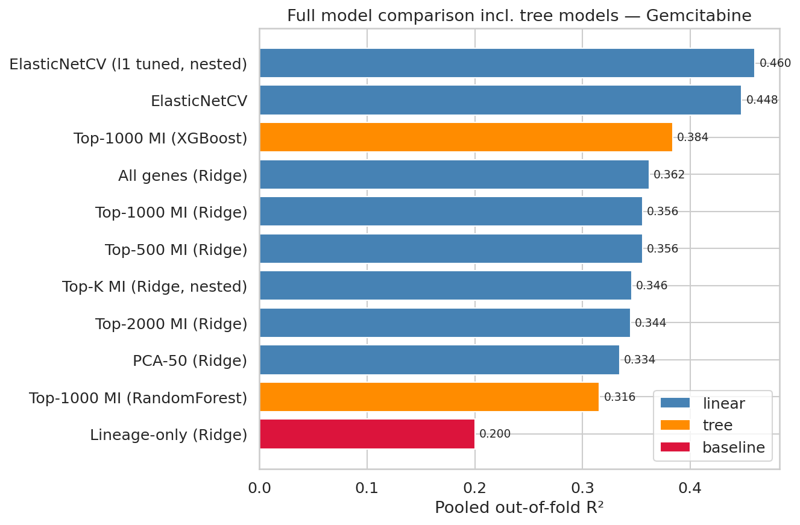
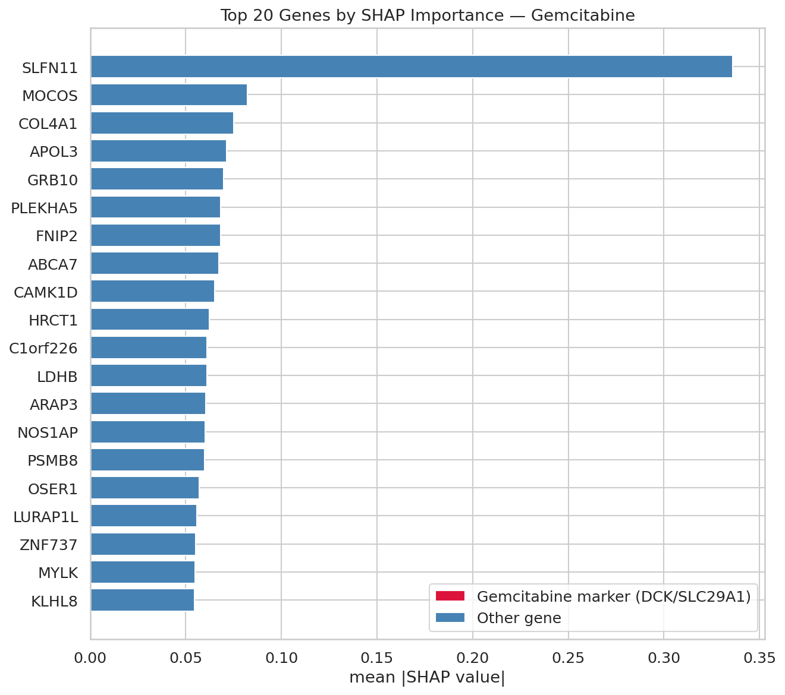

# Predicting Cancer Drug Response from Gene Expression

[](https://github.com/yasminreich/Drug-Response-Project/actions/workflows/ci.yml)
[](LICENSE)
[](https://www.python.org/downloads/release/python-390/)
[](Dockerfile)

Predicting cancer cell-line **sensitivity to Gemcitabine** (`LN_IC50`) from gene-expression
profiles, and asking a sharper question underneath it: **how much of the signal is just tissue
type, and how much do genes genuinely add on top?**

> `LN_IC50` = log half-maximal inhibitory concentration. **Lower = more sensitive** to the drug.



*Pooled out-of-fold R² for every model tried. The red tissue-only baseline is the bar that matters —
anything near it has learned little that tissue type didn't already say. Regularized linear (blue)
beats both tree ensembles (orange) at p ≫ n.*

## Why Gemcitabine

Across the merged dataset, Gemcitabine has the **highest `LN_IC50` variance (9.21)** among drugs
tested on ≥ 690 cell lines — the most signal to model, and a drug with known expression-based
sensitivity biomarkers (e.g. *SLFN11*, *DCK*) to sanity-check against.

## Data

Three public datasets, joined via two ID bridges:

```
GDSC2 (COSMIC_ID) ──→ Model.csv (COSMIC_ID / ModelID) ──→ DepMap Expression (ModelID)
```

| File | Contents | Notes |
|---|---|---|
| `GDSC2_fitted_dose_response_27Oct23.csv` | Drug response (`LN_IC50`) per cell line | tracked in git |
| `Model.csv` | Bridges COSMIC_ID ↔ DepMap ModelID + lineage | tracked in git |
| `OmicsExpressionTPMLogp1HumanProteinCodingGenes.csv` | ~19k gene TPM expression matrix | **518 MB, gitignored** — see below |

The expression matrix must be downloaded separately from the
[DepMap portal](https://depmap.org/portal/data_page/?tab=allData): take the protein-coding
log2(TPM+1) expression export and save it into `data/` as
`OmicsExpressionTPMLogp1HumanProteinCodingGenes.csv`. It must retain the
`IsDefaultEntryForModel` column — the pipeline filters on it to keep one profile per cell line.

After the 3-way join and a variance filter: **694 cell lines × 16,820 genes** — a classic
**p ≫ n** problem (far more features than samples), which drives most of the modelling choices below.

## Method & pipeline

Everything is **leak-free**: scaling and feature selection are fit **inside each CV fold only**.
Evaluation is 5-fold cross-validation, **stratified by tissue lineage** (`OncotreeLineage`), reported
as **pooled out-of-fold R²** (one honest estimate over all 694 cell lines).

The **tissue confound** is central: blood cancers (myeloid/lymphoid) form a distinct, more-sensitive
cluster, so tissue predicts *both* expression and response. Every gene model is therefore compared
against a **lineage-only baseline**, and re-checked on **solid tumours only** (blood cancers removed).

The merge, deduplication, variance filter and split construction live in one module,
[`src/data.py`](src/data.py), which the notebooks import — so no two notebooks can drift into
modelling subtly different datasets. Two rules are enforced there and covered by tests:

1. The expression matrix is filtered to `IsDefaultEntryForModel == "Yes"` (a **string**, not a
   boolean), so each cell line contributes exactly one profile.
2. Deduplication groups by `COSMIC_ID`/`DRUG_NAME`/`ModelID` **only**. Adding a column containing
   NaNs (`TCGA_DESC`) would silently drop those rows, since `pandas.groupby` defaults to
   `dropna=True`.

Notebooks run in order; each depends on the previous. Notebooks 03–05 reuse arrays saved to
`output/` so they never reload the 518 MB matrix.

| Notebook | What it does |
|---|---|
| `notebooks/01_initial_EDA.ipynb` | Loading, quality checks, 3-way merge, drug selection, `LN_IC50` distribution |
| `notebooks/02_preprocessing.ipynb` | Feature matrix, lineage encoding, variance filter, Pearson/PCA *exploration* |
| `notebooks/03_baselines_comparison.ipynb` | Leak-free 5-fold comparison harness; per-lineage + solid-tumour-only confound checks; **nested CV** (§8); **tree models** (§9) |
| `notebooks/04_mlp.ipynb` | PyTorch MLP (BatchNorm + Dropout) on the best representation, same folds, vs Ridge |
| `notebooks/05_interpretability.ipynb` | SHAP on a holdout split + biology check (known Gemcitabine genes) |

## Results

Pooled out-of-fold R² (5-fold stratified CV, n = 694). Higher is better.

| Model | Pooled OOF R² |
|---|---|
| **ElasticNet (l1_ratio tuned, nested CV)** — best | **0.46** |
| ElasticNetCV (l1_ratio = 0.5) | 0.45 |
| XGBoost (top-1000 MI) | 0.38 |
| All genes (Ridge) | 0.36 |
| Top-K MI → Ridge (nested CV) | 0.35 |
| PCA-50 → Ridge | 0.33 |
| RandomForest (top-1000 MI) | 0.32 |
| MLP (top-1000 genes) | 0.27 |
| Lineage-only (confound baseline) | 0.20 |

**Headline findings:**
- **Genes roughly double the tissue-only signal** (0.20 → ~0.46). Expression carries real
  predictive information beyond tissue type.
- **The signal is not just the blood-cancer shortcut** — solid-tumours-only R² stays positive
  (≈ 0.21).
- **Biology checks out.** Top SHAP gene is **SLFN11**, a well-known DNA-damage / Gemcitabine
  sensitivity biomarker; **DCK** (the canonical Gemcitabine-activating enzyme) surfaces further down.



*Top SHAP features. SLFN11 dominates at roughly 4× the next gene — an independent sanity check, since
the model recovered a known DNA-damage/Gemcitabine sensitivity biomarker without being told about it.
Note the canonical markers DCK/SLC29A1 (red in the legend) do **not** appear in the top 20; DCK ranks
~279/1000.*

## What we tried, and what didn't work

Being honest about negative results — several reasonable ideas did **not** beat regularized linear
models, which is expected at p ≫ n with n ≈ 694:

- **A neural network (MLP) underperformed** (R² 0.27) vs. regularized linear (~0.46). With ~19k
  features and ~694 samples, there isn't enough data for a deep model to win — regularized linear is
  the right tool here.
- **Tree ensembles didn't beat linear either.** XGBoost (0.38) was respectable — it edged out Ridge
  on the same features — but couldn't match ElasticNet's L1/L2 selection across all genes;
  RandomForest (0.32) landed near the tissue-only baseline. At p ≫ n, signal is spread thinly across
  many weak genes (a near-additive structure linear models exploit), while greedy tree splits chase a
  few features and overfit. Same lesson as the MLP: extra flexibility doesn't pay at n ≈ 694.
- **PCA-50 → Ridge (0.33) lost to keeping the genes** (all-genes Ridge 0.36; ElasticNet 0.46).
  Compressing to 50 components discards useful signal *and* the gene-level interpretability.
- **The number of selected genes (top-K MI) barely matters.** Nested CV picked K inconsistently
  across folds (500–2000) with near-identical scores — the selection is not the lever.
- **Nested CV barely moved the numbers** (< 0.02 R² in both directions) — the earlier estimates were
  only mildly optimistic. Its value was methodological rigor, not a better score. ElasticNet prefers
  a near-**Lasso** `l1_ratio` (0.9–1.0), not the originally hardcoded 0.5.

See [`EXPERIMENTS.md`](EXPERIMENTS.md) for the full running log of each attempt, result, and takeaway.

## Repository layout

```
├── data/                   # GDSC2 + Model.csv tracked; expression matrix gitignored
├── notebooks/              # 01–05, run in order, committed with their outputs
├── src/data.py             # single source of truth: merge, dedup, filter, splits
├── tests/                  # pytest: dedup rule, default-entry filter, leakage, splits
├── output/                 # generated arrays + figures (gitignored)
├── docs/assets/            # the few figures embedded in this README
├── Dockerfile              # the only supported environment
├── EXPERIMENTS.md          # per-phase running log
└── .github/workflows/ci.yml
```

## Reproducing

All work runs inside Docker (`drug_response_env`) — never locally with pip.

```bash
# 1. Build the image
docker build -t drug_response_env .

# 2. Download the DepMap expression matrix into data/ (see Data above)

# 3. Execute a notebook in place
docker run --rm -v "<absolute-repo-path>":/app drug_response_env \
    jupyter nbconvert --to notebook --execute --inplace notebooks/03_baselines_comparison.ipynb
```

Run the tests — no expression matrix needed, they use a synthetic fixture joined to the real
tracked ID tables:

```bash
docker run --rm -v "<absolute-repo-path>":/app -w /app drug_response_env pytest tests/ -q
```

To work interactively, start Jupyter and open the URL it prints:

```bash
docker run -it --rm -v "<absolute-repo-path>":/app -p 8888:8888 drug_response_env
```

Dependencies are **pinned** in `requirements.txt` to the versions that produced the numbers above;
results are version-sensitive, so re-pin deliberately and re-run notebook 03 if you change them.
Plots and intermediate arrays are written to `output/` (gitignored).

## Data sources & citations

This project analyses two public datasets. If you use this work, please cite them:

- **GDSC2** — Yang W., Soares J., Greninger P., *et al.* "Genomics of Drug Sensitivity in Cancer
  (GDSC): a resource for therapeutic biomarker discovery in cancer cells." *Nucleic Acids Research*
  41:D955–D961 (2013). [doi:10.1093/nar/gks1111](https://doi.org/10.1093/nar/gks1111)
- **DepMap / CCLE** — Ghandi M., Huang F.W., Jané-Valbuena J., *et al.* "Next-generation
  characterization of the Cancer Cell Line Encyclopedia." *Nature* 569:503–508 (2019).
  [doi:10.1038/s41586-019-1186-3](https://doi.org/10.1038/s41586-019-1186-3)

Machine-readable metadata is in [`CITATION.cff`](CITATION.cff).

**Licensing.** The code in this repository is MIT-licensed ([`LICENSE`](LICENSE)). That licence
covers the code only — the datasets bundled in `data/` are redistributed from
[GDSC](https://www.cancerrxgene.org/) and [DepMap](https://depmap.org/portal/) and remain subject
to their own terms of use.

## Roadmap

- ~~**Phase 1** — nested CV for unbiased hyperparameter selection.~~ ✅ done
- ~~**Phase 2** — non-linear tree models (RandomForest, XGBoost) in the same harness.~~ ✅ done
- **Phase 3** — a deeper neural approach: unsupervised autoencoder on the full expression matrix,
  then a regressor on the learned embedding; optionally multi-task across several drugs.
- **Phase 4** — finalize documentation.
